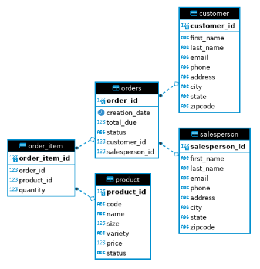

# Introduction

The JDBC Application allows users' manipulating a PostgreSQL database through Java programming. The application is equipped with the ability to perform CRUD (Create, Read, Update, Delete) operations on Customer and Order data. The Data Access Object (DAO) pattern is implemented to manipulate Data Transfer Objects (DTO). The following include some of the key technologies used in this implementation:

- Java 8
- JDBC API
- PostgreSQL
- Maven

# Implementation
## ER Diagram

## Design Patterns

The Data Access Object pattern implements a layer of abstraction between the JDBC and the rest of the code. The DAO pattern can support multiple tables and is often used when vertical upscaling is required.

The Repository pattern emphasizes single-table access per class and joining in code rather than in the database. The repository pattern allows for sharding of the database, which is especially useful when implementing distributed databases.

# Test

A test database is set up in PostgreSQL locally and populated with over 1000 lines of data across 5 different tables. Manual testing was conducted in Java and subsequently verified through CLI access of the PostgreSQL test database.
