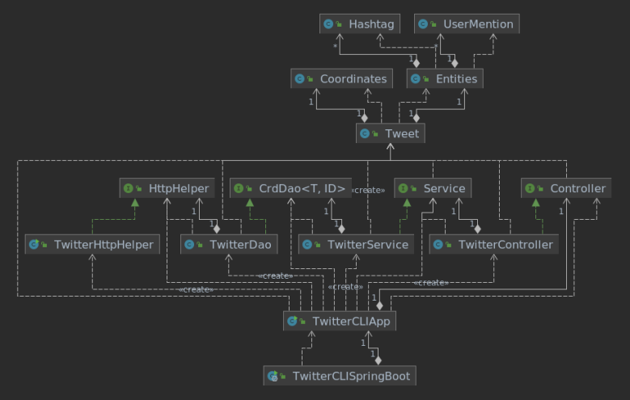

# Introduction

This application uses the Twitter REST API to post, read and delete tweets. The application uses the
OAuth 1.0 authentication method and is designed through the MVC architecture, in which business
logic and data handling are compartmentalized into separate interactive layers. Maven is used for
managing and maintaining the project, which is deployed through a Docker image. JUnit is used for
integration and unit testing. The following include some of the key technologies used in this
implementation:

- Java 8
- Twitter REST API
- IntelliJ IDEA
- Maven
- Docker

# Quick Start

1. Run the program with the Jar file

```bash
# Clean build with Maven
mvn clean compile package

# Run application with jar file
# Post
java -jar ./target/twitter-1.0-SNAPSHOT.jar post "text" "latitude:longitude"
# Show
java -jar ./target/twitter-1.0-SNAPSHOT.jar show [tweet_id] "field1,field2,..."
# Delete
java -jar ./target/twitter-1.0-SNAPSHOT.jar delete "id1,id2,..."
```

2. Run the program with Docker

```bash
# Pull Docker image
docker pull williamyll/twitter

# Run Docker container
# Post
docker run --rm \
-e consumerKey=YOUR_VALUE \
-e consumerSecret=YOUR_VALUE \
-e accessToken=YOUR_VALUE \
-e tokenSecret=YOUR_VALUE \
williamyll/twitter post "text" "latitude:longitude"
# Show
docker run --rm \
-e consumerKey=YOUR_VALUE \
-e consumerSecret=YOUR_VALUE \
-e accessToken=YOUR_VALUE \
-e tokenSecret=YOUR_VALUE \
williamyll/twitter show [tweet_id] "field1,field2,..."
# Delete
docker run --rm \
-e consumerKey=YOUR_VALUE \
-e consumerSecret=YOUR_VALUE \
-e accessToken=YOUR_VALUE \
-e tokenSecret=YOUR_VALUE \
williamyll/twitter delete "id1,id2,..."
```

# Design

## UML diagram



- `TwitterCLIApp` is the entry point of the application. The appropriate controller method is called
  base on user input. The response is displayed to the user.
- `TwitterController` parses the user input and the appropriate service method is called.
- `TwitterService` handles the business logic of the application:
    - Text length does not exceed 140 characters
    - Latitude (-90 to 90 degrees) and Longitude (-180 to 180 degrees) are not out of range
    - Tweet id is in the correct format (numerical)
- `TwitterDAO` executes requests against the Twitter REST API with the help of `TwitterHttpHelper`
  and handles responses appropriately.

## Models

The `Tweet` class is used to construct a simplified version of the official model of the Tweet
object. The following is the aforementioned simple Tweet model rendered in JSON:

```bash
{
  "created_at" : "Tue Aug 31 02:08:53 +0000 2021",
  "id" : 1432525769138446337,
  "id_str" : "1432525769138446337",
  "text" : "jar test",
  "entities" : {
    "hashtags" : [ ]
  },
  "coordinates" : {
    "coordinates" : [ 50.0, 50.0 ],
    "type" : "Point"
  },
  "retweet_count" : 0,
  "favorite_count" : 0,
  "favorited" : false,
  "retweeted" : false
}
```

Attribute | Data Type | Description
---------- | ---------- | ----------
created_at | String | Time of Tweet creation
id | long | Tweet id
id_str | String | Tweet id
text | String | Tweet text
entities | Entities | Hashtags and user mentions
coordinates | Coordinates | Latitude and longitude
retweet_count | long | Number of retweets
favorite_count | long | Number of favourites
favorited | boolean | If favourited
retweeted | boolean | If retweeted

## Spring

The Spring framework introduced several ways of managing dependencies:

- In `TwitterCLIBean`, the `@Bean` annotation is used to identify components, and dependency
  relationships are shown through constructor arguments. The Inversion of Control (IoC) container
  instantiates all beans based on defined relationships.
- In `TwitterCLIComponentScan`, the `@Autowired` annotation is used to identify dependency
  injections through the constructors. Specific `@Components` are specified for the IoC.
- In `TwitterCLISpringBoot` implements Spring Boot, which is an extension of the Spring framework
  and enables automated configurations.

# Test

JUnit 4 was used to perform both integration and unit testing. The Mockito framework was employed to
mock the behaviour of dependencies in unit testing. Integration testing verified that various layers
and components work coherently.

## Deployment

The application was deployed as a Docker image named williamyll/twitter. The image is available in a
public repository on Docker Hub. The following commands were used to dockerize the application:

```bash
# Log into Docker Hub account
docker login -u williamyll
# Create Dockerfile
cat > Dockerfile << EOF
FROM openjdk:8-alpine
COPY target/twitter*.jar /usr/local/app/twitter/lib/twitter.jar
ENTRYPOINT ["java","-jar","/usr/local/app/twitter/lib/twitter.jar"]
EOF
# Package twitter app
mvn clean package
# Build a new Docker image locally
docker build -t williamyll/twitter .
# Verify image
docker image ls | grep "twitter"
# Push image to Docker Hub
docker push williamyll/twitter
```

# Improvements

- Search for Tweets based on content using regex
- Implement additional Twitter features, such as retweets, etc.
- Improve Tweet model
